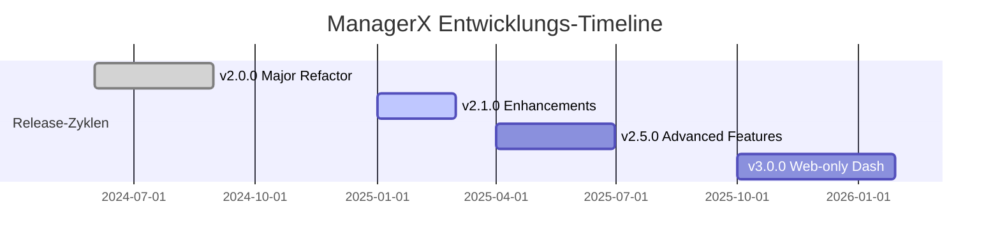

<div align="center">


# 🤖 ManagerX Discord Bot

### *Der intelligente All-in-One Bot für professionelles Community-Management*

<br>

[](https://status.oppro-network.de)
[](https://github.com/Oppro-net-Development/ManagerX/releases)
[](#-roadmap)
[](https://github.com/Oppro-net-Development/ManagerX/commits/main)
[](LICENSE)

<br>

```ascii
╔══════════════════════════════════════════════════════════════════════╗
║                                                                      ║
║     🤖  PROFESSIONAL DISCORD BOT FRAMEWORK • COMMUNITY READY  🚀    ║
║                                                                      ║
║   Moderation • Leveling • Welcome • TempVC • Globalchat • Stats    ║
║                                                                      ║
╚══════════════════════════════════════════════════════════════════════╝
```

<br>

**Entwickelt von** [**OPPRO.NET Development**](https://github.com/Oppro-net-Development) **|** ⚡ **Powered by OPPRO.NET Network™**

<br>

<p align="center">
  <a href="#-was-ist-managerx"><b>Was ist das?</b></a> •
  <a href="#-features"><b>Funktionsumfang</b></a> •
  <a href="#-installation"><b>Setup</b></a> •
  <a href="https://docs.managerx-bot.de"><b>Dokumentation</b></a> •
  <a href="#-support--community"><b>Hilfe</b></a>
</p>

</div>

<br>

---

## 📁 Projektstruktur

Das Projekt ist modular aufgebaut, um maximale Performance und Wartbarkeit zu gewährleisten.

```text
ManagerX/
├── 📂 .github/           # GitHub-Workflows & Projektdaten (License, Contributing)
├── 📂 config/            # Globale Bot-Konfiguration & Umgebungsvariablen
├── 📂 data/              # Lokale Persistenz (Datenbanken, JSON-Stats)
├── 📂 src/
│   ├── 📂 bot/           # 🐍 Core Bot Logic & Cog-System
│   ├── 📂 api/           # ⚡ FastAPI Dashboard Backend
│   └── 📂 web/           # ⚛️ React/Tailwind Dashboard Frontend
├── 📜 main.py            # Haupteinstiegspunkt für den Bot
└── 📜 vite.config.ts     # Build-Pipeline für das Web-Interface
```

---

## 📦 Schnellstart

Wähle die passende Installationsmethode für dein Szenario:

<table>
<tr>
<td width="50%" align="center">

### 🎯 Für Community-Inhaber
*Maximale Stabilität, Minimaler Aufwand*

```bash
pip install ManagerX[all]
```

</td>
<td width="50%" align="center">

### 👨‍💻 Für Entwickler
*Voller Zugriff auf den Source-Code*

```bash
git clone https://github.com/ManagerX-Development/ManagerX.git
pip install -e .[dev]
```

</td>
</tr>
</table>

<br>

<div align="center">

## 🎯 Was ist ManagerX?

</div>

**ManagerX ist ein Discord Bot**, der als hochmoderne und leistungsstarke Lösung für das professionelle Community-Management konzipiert wurde. Durch die Verbindung einer robusten Python-Architektur mit einem Echtzeit-Web-Interface bietet ManagerX alles, was anspruchsvolle Server für Skalierung, Sicherheit und Engagement benötigen.

<br>

### 🌟 Kernvorteile

<table>
<tr>
<td align="center" width="50%">

**⚡ Performance & Speed**
<br>
Optimierte SQLite-Architektur & Caching für blitzschnelle Reaktionen, selbst bei tausenden Events.

</td>
<td align="center" width="50%">

**🛡️ Enterprise Security**
<br>
Umfassendes Anti-Spam, Moderations-Logs und granulare Sicherheits-Features für deine Community.

</td>
</tr>
<tr>
<td align="center">

**🎨 Vollständige Anpassbarkeit**
<br>
Jedes Modul kann über das Dashboard oder Command-Interface individuell konfiguriert werden.

</td>
<td align="center">

**🌍 Globales Netzwerk**
<br>
Verbinde deine Community mit Servern weltweit über unser integriertes Globalchat-System.

</td>
</tr>
</table>

<br>

---

<div align="center">

## ✨ Feature-Deep-Dive

*Entdecke die mächtigen Werkzeuge von ManagerX*

</div>

<br>

### 🛡️ Moderation & Sicherheit
*Sicherheit auf Enterprise-Niveau für deinen Server.*

- **Vollständiges Toolkit**: `/ban`, `/kick`, `/mute`, `/warn`, `/timeout`, `/purge`.
- **Intelligentes Anti-Spam**: Duplicate Detection, Mention Protection & Link-Filter.
- **Action-History**: Lückenlose Protokollierung aller Moderations-Ereignisse.
- **Evidence Collection**: Automatisierte Beweissicherung für Moderations-Fälle.

### 📊 Community & Engagement
*Baue eine aktive und loyale Community auf.*

- **Smart Leveling**: Dynamisches XP-System für Voice & Text mit Multiplikatoren.
- **Auto-Rewards**: Automatische Rollenvergabe bei Stufenaufstiegen.
- **Interaktive Leaderboards**: Lokale und globale Rankings für maximalen Wettbewerb.
- **Welcome 2.0**: Hochwertige Embed-Designs und automatisierte Onboarding-Prozesse.

### �️ Voice & Automatisierung
*Dynamische Kanäle für moderne Kommunikation.*

- **Temporary Voice**: User-gesteuerte Sprachkanäle mit voller Permission-Control.
- **Auto-Cleanup**: Intelligente Löschung inaktiver Kanäle spart Ressourcen.
- **Live-Stats**: Echtzeit-Analysen über Voice-Aktivität und User-Engagement.
- **Toolbox**: Integrationen wie Google-Search, Wetterdaten und Wikipedia.

<br>

---

<div align="center">

## ⚙️ Technischer Stack

</div>

<table>
<tr>
<td><b>Kern</b></td>
<td>Python 3.10+, Pycord, Ezcord</td>
</tr>
<tr>
<td><b>Interface</b></td>
<td>FastAPI, React (Vite), TailwindCSS, Lucide Icons</td>
</tr>
<tr>
<td><b>Daten</b></td>
<td>SQLite3 (lokal), JSON-Analytics</td>
</tr>
<tr>
<td><b>Deployment</b></td>
<td>Docker-ready, Linux/Windows/macOS Unterstützung</td>
<br>

---

<div align="center">

## 🚀 Installation & Setup

*Starte dein Community-Management in wenigen Minuten*

</div>

<br>

### 📋 Voraussetzungen

<table>
<tr>
<td width="50%">

**System-Anforderungen**
- Python 3.10 oder höher
- Git 2.0+
- RAM: 512 MB minimum (1 GB empfohlen)
- OS: Linux (Ubuntu rec.), Windows, macOS

</td>
<td width="50%">

**Zusätzliche Dienste**
- Discord Bot Token ([Developer Portal](https://discord.com/developers/applications))
- Weather API Key ([OpenWeatherMap](https://openweathermap.org/api)) - *Optional*
- Eigene Domain & SSL - *Optional für Dashboard*

</td>
</tr>
</table>

<br>

### ⚡ Schritt-für-Schritt Anleitung

<details>
<summary><b>🐧 Linux / 🍎 macOS Setup</b> (Klicken zum Aufklappen)</summary>

```bash
# 1. Repository klonen
git clone https://github.com/Oppro-net-Development/ManagerX.git
cd ManagerX

# 2. Virtual Environment & Dependencies
python3 -m venv venv
source venv/bin/activate
pip install -r requirements.txt

# 3. Konfiguration erstellen
cp .env.example .env
nano .env  # Token und Einstellungen anpassen

# 4. Datenbank initialisieren & Start
python -c "from utils.database import init_db; init_db()"
python main.py
```

</details>

<details>
<summary><b>🪟 Windows Setup</b> (Klicken zum Aufklappen)</summary>

```powershell
# 1. Repository klonen
git clone https://github.com/Oppro-net-Development/ManagerX.git
cd ManagerX

# 2. Virtual Environment & Dependencies
python -m venv venv
venv\Scripts\activate
pip install -r req.txt

# 3. Konfiguration erstellen
copy .env.example .env
notepad .env  # Token und Einstellungen anpassen

# 4. Datenbank initialisieren & Start
python -c "from utils.database import init_db; init_db()"
python main.py
```

</details>

<br>

---

<div align="center">

## 📋 Roadmap & History

*Unsere Vision für die Zukunft von ManagerX*

</div>

<br>

### 🔄 Release Timeline



<br>

### 🗺️ Meilensteine

- [x] **v2.0.0**: Kompletter Code-Rewrite, Globalchat v2 & neues API-Backend.
- [/] **v2.1.0**: Performance-Optimierungen, Enhanced Error Recovery & UI/UX Politur.
- [ ] **v2.2.0**: Ticket-System, Fortgeschrittene Umfragen, Musik-Modul 2.0.
- [ ] **v2.5.0**: Plugin-System für Third-Party Module, Deep Learning Moderation.

<br>

---

<div align="center">

## 🤝 Mitwirken & Entwicklung

Werde Teil unserer Open-Source Community!

<br>

<table>
<tr>
<td width="25%" align="center">**🐛 Bugs**<br>[Melden →](https://github.com/Oppro-net-Development/ManagerX/issues)</td>
<td width="25%" align="center">**✨ Features**<br>[Vorschlagen →](https://github.com/Oppro-net-Development/ManagerX/issues)</td>
<td width="25%" align="center">**💻 PRs**<br>[Beitregen →](https://github.com/Oppro-net-Development/ManagerX/pulls)</td>
<td width="25%" align="center">**📖 Docs**<br>[Verbessern →][def]</td>
</tr>
</table>

</div>

<br>

---

<div align="center">

## 💬 Support & Community

Brauchst du Hilfe? Tritt unserer Community bei!

<br>

[](https://discord.gg/oppro)
[](https://twitter.com/ManagerX)
[](https://managerx-bot.de)

<br>

**ManagerX** wird mit ❤️ von [OPPRO.NET](https://oppro-network.de) entwickelt.
<br>
*Copyright © 2026 ManagerX Development • Lizenziert unter GPL-3.0*

</div>

[def]: https://github.com/Oppro-net-Development/ManagerX-Docs
```